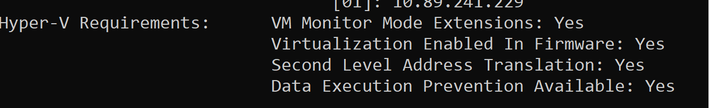

# CKAD-free-course
## Configure Minikube K8S environment 
  1. ## Install and Set Up kubectl
      ### Windows
      1. Download from below location and add the kubectl.exe to PATH variable. 
      https://storage.googleapis.com/kubernetes-release/release/v1.19.0/bin/windows/amd64/kubectl.exe
      2. Test to ensure the version you installed is up-to-date
          kubectl version --client
       ### MAC
      1. Download the latest release
       curl -LO "https://storage.googleapis.com/kubernetes-release/release/$(curl -s https://storage.googleapis.com/kubernetes-release/release/stable.txt)/bin/darwin/amd64/kubectl"
      2. Make the kubectl binary executable.
       chmod +x ./kubectl
      3. Move the binary in to your PATH.
       sudo mv ./kubectl /usr/local/bin/kubectl
      4. Test to ensure the version you installed is up-to-date
          kubectl version --client
  2. ## Install Minikube
      ### Windows
      
      1. Check if virtualization is supported.
           run 'systeminfo' command in command prompt.
          Below output should be shown.
          
      
      2. Click this <a href="https://github.com/kubernetes/minikube/releases/latest/download/minikube-installer.exe">link</a> to download minikube installer. And run the installer to install the minikube in windows machine.
      3.Download and install VirtualBox from this <a href="https://download.virtualbox.org/virtualbox/6.1.12/VirtualBox-6.1.12-139181-Win.exe"> link </a>.
       ### MAC
      1. Check if virtualization is supported.
           sysctl -a | grep -E --color 'machdep.cpu.features|VMX'
           If you see 'VMX' in the output, the VT-x feature is enabled in your machine.
      2. Install it by downloading a stand-alone binary:.
          curl -Lo minikube https://storage.googleapis.com/minikube/releases/latest/minikube-darwin-amd64 \
          && chmod +x minikube
      3. Download and install VirtualBox from this <a href="https://download.virtualbox.org/virtualbox/6.1.12/VirtualBox-6.1.12-139181-OSX.dmg"> link </a>.

     
